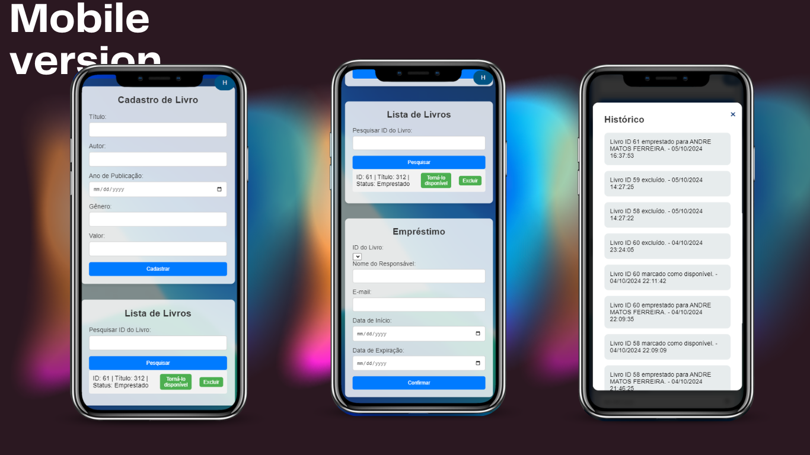

# SUGL - Sistema Universal de Empréstimo de Livros

Este projeto é um sistema de gerenciamento de empréstimos de livros para bibliotecas comunitárias. O sistema permite registrar e controlar empréstimos de livros e devoluções, utilizando uma interface com **Flask** (backend), **PostgreSQL** (banco de dados).

## Sobre o Aplicativo

O SUGL foi desenvolvido para facilitar o gerenciamento de bibliotecas comunitárias, permitindo que os administradores registrem livros, usuários e transações de empréstimo e devolução de forma eficiente. Além disso, o sistema envia notificações via Telegram para manter os usuários informados sobre o status de seus empréstimos.

### Funcionalidades Principais

- **Registro de Livros**: Adicione novos livros ao sistema com informações detalhadas.
- **Registro de Usuários**: Cadastre membros da biblioteca com seus dados de contato.
- **Empréstimos e Devoluções**: Gerencie o processo de empréstimo e devolução de livros, atualizando o status em tempo real.
- **Relatórios**: Gere relatórios sobre livros disponíveis e emprestados para melhor controle.
- **Histórico de operaçoes**: 


## Requisitos

- **Python 3.x**
- **PostgreSQL** instalado e configurado
- **Conta no Telegram** para usar a API de Bots
- **Flask** e dependências listadas no arquivo `requirements.txt`

## Instalação

1. Clone o repositório:
    ```bash
    git clone https://github.com/seuusuario/biblioteca-comunitaria.git
    ```

2. Crie um ambiente virtual e ative-o:
    ```bash
    python -m venv venv
    source venv/bin/activate  # No Windows use `venv\Scripts\activate`
    ```

3. Instale as dependências:
    ```bash
    pip install -r requirements.txt
    ```

4. Configure o banco de dados PostgreSQL e atualize as configurações no arquivo `config.py`.

## Uso do Sistema

1. Execute a aplicação:
    ```bash
    python run.py
    ```

2. Acesse a aplicação no navegador:
    ```
    http://localhost:5000
    ```

3. **Cadastrar Livros**: Adicione os livros disponíveis na biblioteca.
4. **Cadastrar Usuários**: Registre os usuários com seu ID de Telegram.
5. **Registrar Empréstimos**: Utilize o sistema para registrar o empréstimo de livros.
6. **Devolver Livros**: Atualize o status de devolução quando o usuário devolver o livro.
7. **Relatórios**: Gere relatórios sobre livros disponíveis e emprestados.

## Imagens

### Mobile Version



### Desktop Version


## Contribuição

1. Faça um fork do projeto.
2. Crie uma nova branch:
    ```bash
    git checkout -b minha-nova-feature
    ```
3. Faça suas alterações e commit:
    ```bash
    git commit -m 'Adiciona nova feature'
    ```
4. Envie para o repositório original:
    ```bash
    git push origin minha-nova-feature
    ```
5. Crie um Pull Request.


## Diagrama do projetop


## Licença

Este projeto está licenciado sob a MIT License.
